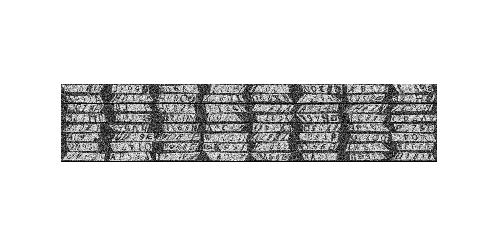

# ML_classification_template
This repository is the template for using custom dataset to train the classification problem with pytorch 
the example is custom concatenate the picture between alphabet and number with various fonts as shown in the picture

  

The goal is to train the neural network so that it can classify the double digits such as in the picture

This repository is not include the training dataset, for whom interested to try out, you can download the dataset from 
https://www.kaggle.com/thomasqazwsxedc/alphabet-characters-fonts-dataset?select=Images and https://www.kaggle.com/karnikakapoor/digits

after download, please extract it and put it in the dataset folder

for training, please run the training.py and can check the result in enjoy.py

Finally, the given model has not yet fine tuning.
